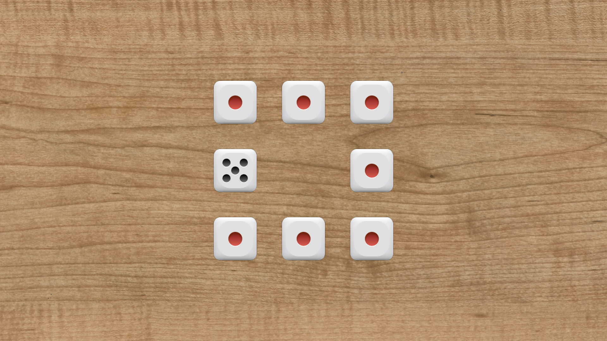

# Roll of the Dice

This game is made following the theme of the [2022 GMTK Game Jam](https://itch.io/jam/gmtk-jam-2022).

## Rules

Eight dice are on a table, organised in a square with one empty spot.

Move the dice around, then try to get them back to showing 1!

## Resources

- Dice Sprites: <https://opengameart.org/content/dice-4>
- Wood Background: <https://www.freeimages.com/photo/wood-grain-1148995>
